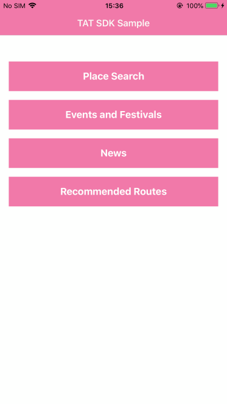

# TAT-SDK-iOS-Sample app

Welcome to the TAT-SDK-iOS Sample application. This application demostrates how to use the TAT-SDK for iOS inside an iOS app.

## Prerequisites

You can get **API Key** from [TAT Developer Guide and Console](https://developers.tourismthailand.org/console) website.

## Download TAT-SDK-iOS
[  ](https://github.com/TATSDK/TAT-SDK-iOS-Sample)

install CocoaPods:

```
pod 'TATSDK'
```
## How do I use TAT-SDK-iOS ?

Setup API Key for initial environment in application like this:

```swift
// Setup API Key in AppDelegate.swift
 func application(_ application: UIApplication, didFinishLaunchingWithOptions launchOptions: [UIApplication.LaunchOptionsKey: Any]?) -> Bool {
        // Override point for customization after application launch.
        TATSDKEnvironment.setAPIKey("API_KEY")
        return true
    }
```

 * SDK Reference: [TAT-SDK-iOS Reference](https://tatapi.tourismthailand.org/tatsdk/References/ios/Index.html)
 
## Samples
1. [Place Search](/TATSDKSample/Search/README.md)
2. [Events and Festivals](/TATSDKSample/Event/README.md)
3. [News](/TATSDKSample/News/README.md)
4. [Recommended Routes](/TATSDKSample/RecommendedRoute/README.md)




## Requirements

 * iOS 8.0 or later
 * Xcode 10.0 or later

## Authors

* Power by GLOBETECH Co., Ltd - [GlobeTech Co., Ltd. – CDG](https://www.cdg.co.th/website/about-cdg/affiliates-of-cdg/globetech-co-ltd/)
* Developed by GEOTALENT Co., Ltd - [GEOTALENT | GIS Developer](https://www.geotalent.co.th)

## License

* Copyright © <a href="https://www.tourismthailand.org/home" target="_blank">Tourism Authority of Thailand</a>.
