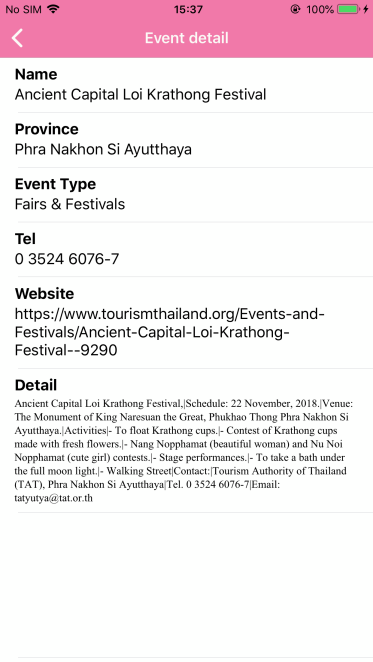

# Get list of Events and Event Detail 

This sample demonstrates how to use `TATGetEvents` to get the list of events with `TATGetEventsParameter` and how to get the detail of event from `TATGetEventDetail` with `TATGetEventDetailParameter` to show in `TATGetEventDetailResult`.

## Get Events parameters
 * **latitude and longitude** *value when you want to search events around you.*
 * **sort** *use `TATEventSortType.distance` for sorted by Dsiatnce or `TATEventSortType.date` for sorted by start date of event.*
 * **language** *use `TATLanguage.english` for English display or `TATLanguage.thai` for Thai display.*

## How to use the sample
 1. Choose sort menu on navigation bar that show 2 options are By Date or By Distance.
 2. The results are sorted according by sort option you choose.

### Get Events

### Sort options

## Get Event Detail parameters
 * **eventID** *from events result*
 * **language** *use `TATLanguage.english` for English display or `TATLanguage.thai` for Thai display.*

## How to use the sample
 1. Choose one of event from result.
 2. Show the result of the selected event.

### Event Detail
