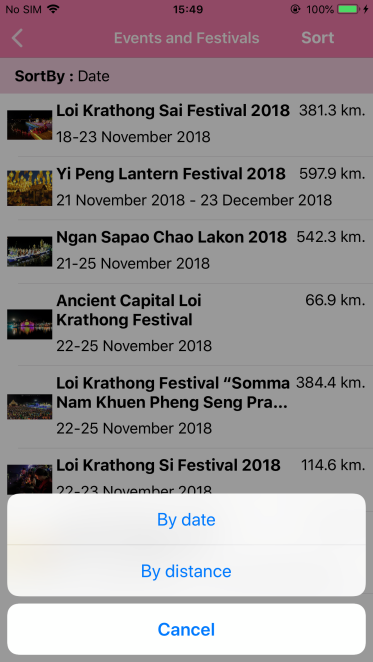

# Find Events and Get Event's detail

This sample demonstrates how to use `TATEvents` to get the list of events and how to get event's detail from TAT SDK.

# Find Events
How to use `TATEvents` to find the list of events by `find` method or find the list of events around you by `findNearby` method.
## Parameters
* **language** use `TATLanguage` to set display language. *supported `.english` for display in English or `.thai` for display in Thai.*
* **geolocation** use `TATGeolocation` set up tha latitude, longitude value when you want to search the events around.
* **sort** use `TATEventSortBy` is the enumerable to sort the events. *supported: `.distance` for sorted by distance or use `.date` for sorted by start date of event.*

## How to use the sample
 1. Choose sort menu on navigation bar that show 2 options are By Date or By Distance.
 2. The results are sorted according by sort option you choose.

### Find Events

### Sort options

# Get Event's detail
How to use `TATEvents` to get the event's detail by `getDetail` method with event id.
## Parameters
* **id** The Event ID from find events result.
* **language** use `TATLanguage` to set display language. *supported `.english` for display in English or `.thai` for display in Thai.*

## How to use the sample
 1. Choose one of event from result.
 2. Show the result of the selected event.

### Get Event's detail
