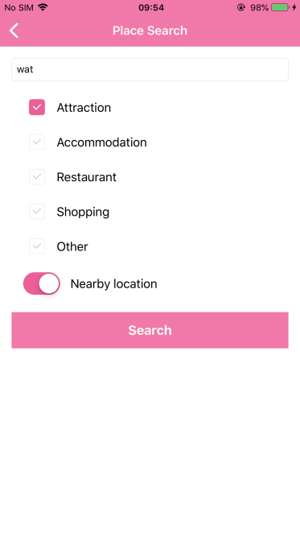
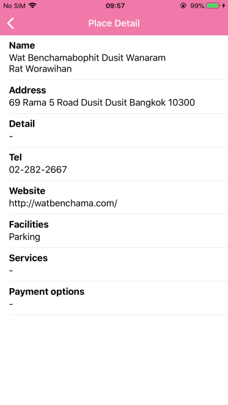

# Place Search and Get Place's detail

This sample demonstrates how to search and get the place detail from TAT SDK.

# Place Search
How to use `TATPlaces` to search places by `search` method.
## Parameters
 * **keyword** The keyword to search *such as place's name, latitude and longitude of place or mapcode.*
 * **categorycodes** use `TATCategoryCode` enumerable for specific search category *supported `.all`, `.other`, `.shop`, `.restaurant`, `.accommodation` or `.attraction`.*
 * **geolocation** use `TATGeolocation` set up tha latitude, longitude value when you want to search the places around.
 * **provinceName** The name of province for specific province that you want to search.
 * **searchradius** The search radius is the meter unit which is referenced with latitude, longitude. *(Maximum is 200,000 meters. The default is 100 meters)*
 * **numberOfResult** The number of result. *(Maximum is 50 items. The default is 20 items.)*
 * **language** use `TATLanguage` to set display language. *supported `.english` for display in English or `.thai` for display in Thai.*

## How to use the sample
 1. Enter keyword to search.
 2. Choose categories one or more options.
 3. Select `Nearby location` when used the location reference search result.
 4. Click `Search` button to get place result.
 5. When you clicked a result that show the detail of place by category.

### Place Search

### Place Search Result

# Get Place's detail
How to use `TATPlaces` to get place's detail and use the category of place to choose the get detail method, such as: `getAttraction`, `getAccommodation`, `getRestaurant`, `getShop` and `getOtherPlace` method with place id from search result.

## Parameters
 * **id** The Place ID from search result.
 * **language** use `TATLanguage` to set display language. *supported `.english` for display in English or `.thai` for display in Thai.*

## How to use the sample
 1. Choose one of place from result.
 2. Show the result of the selected place.

### Get Place's detail

